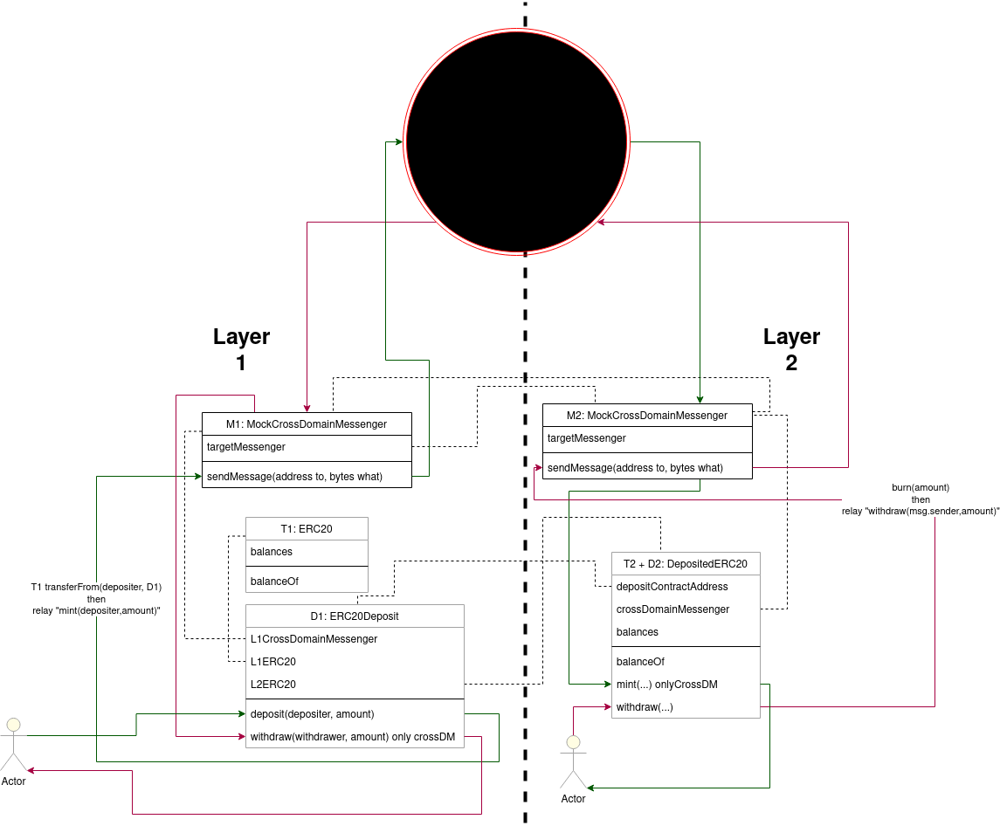

# Buidler-Deposit-Withdraw-Example
A simple ERC20 token project in Buidler to get started testing L1 <->L2 communication.
To get started:
```
yarn
yarn test
```
## Model


[Disgram image source](https://drive.google.com/file/d/1Eu9XuxEMTKAe_4y6zrLUUtYLEYig5UmG/view)
